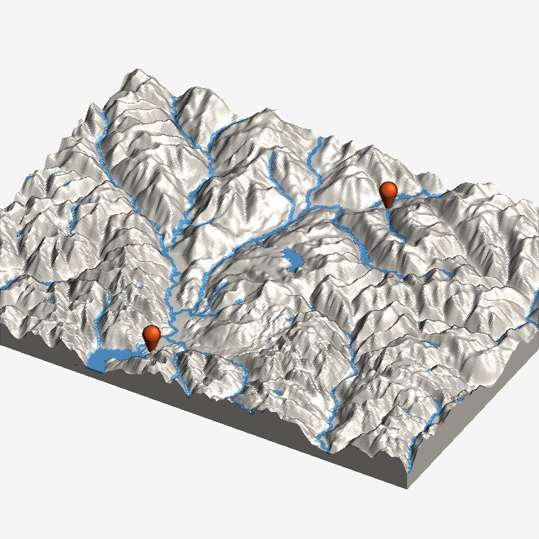
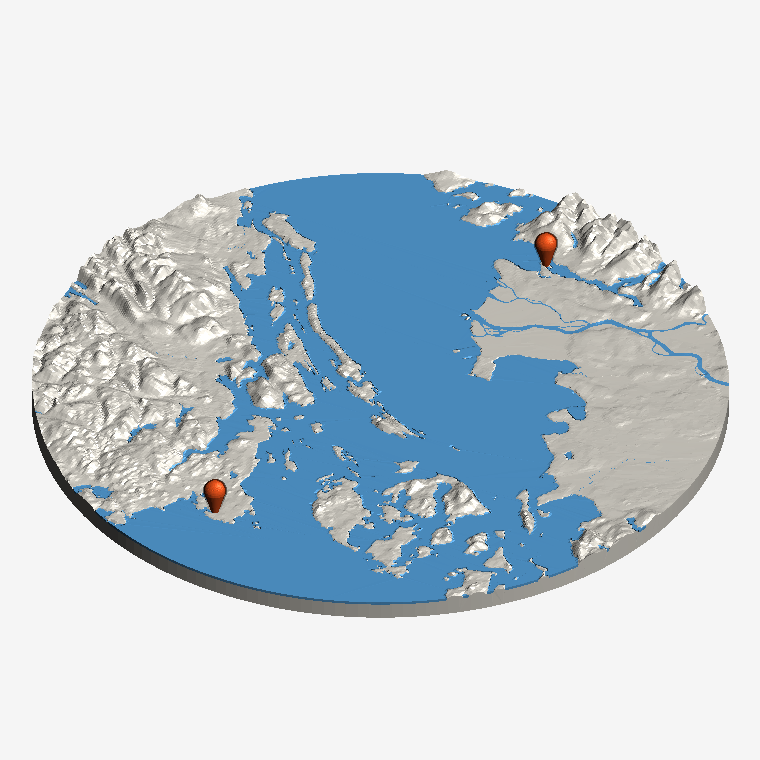

# Topo map generator

A piece of the real world in relief, ready to 3D print: the ground from
satellite elevation data, the sea, lakes and rivers from OpenStreetMap in a
second colour, and a map pin standing on each place you name.  Plain Python
-- shapely for the 2-D work, trimesh and manifold for the solids.

Moved here from [TTVV-7/3D-print-sandbox](https://github.com/TTVV-7/3D-print-sandbox),
where it was the sixth shape in that app's generator.  This repository has
the map on its own: `src/topo.py` builds it, `src/solids.py` is the part of
the sandbox's `cards.py` it needs (the booleans, the plate and the two 3MF
writers), and the page is a topo-only one.

## Running it

```
pip install -r requirements.txt
python3 src/app.py            # then open http://127.0.0.1:8765
```

Type some places, watch the map turn in the viewer, download a 3MF (land,
water and pins each on its own filament) or an STL (all three welded into
one).  It needs the network: the map is fetched for wherever you ask.

On Vercel, `public/index.html` is served as a static file and
`api/model.py` answers `/api/model` with the same handler `src/app.py` runs
locally.  A `GET /api/model` builds a small map and reports whether the
geometry libraries and the tile fetches work where it is deployed.

---

# How it works

Name some places and get the ground round them: the mountains and valleys
from satellite elevation data, the sea flat at sea level, every lake flat at
its own level, rivers following their valleys down, and a map pin standing
on each place.  Three colours -- land, water, pins -- each its own solid, so
the 3MF opens in the slicer with nothing to paint.

| | |
|---|---|
|  |  |

Left, Squamish and Whistler, fitted round the two pins, the heights
stretched 2.5 times.  Right, a round one of the Salish Sea with Stanley Park
and Victoria pinned: the Fraser running out through its delta on the right,
the Gulf Islands down the middle.

## Where the map comes from

Nothing is stored here; everything is looked up when you ask, and none of it
needs a key.

- **The ground** is the [AWS Terrain Tiles](https://registry.opendata.aws/terrain-tiles/)
  -- SRTM, GMTED, ETOPO1 and national surveys merged into one world -- as
  Terrarium PNGs, whose red, green and blue are the height in metres.  The
  zoom is picked so a pixel is about a grid cell on the model.
- **The water** is OpenStreetMap, as [OpenFreeMap](https://openfreemap.org)'s
  vector tiles: the `water` layer's ocean, lake and river polygons and the
  `waterway` layer's lines.  `src/topo.py` reads the protobuf itself rather
  than adding a dependency for it.
- **The places** are OpenStreetMap's [Nominatim](https://nominatim.org), one
  lookup a second as it asks, and Komoot's [Photon](https://photon.komoot.io)
  when Nominatim turns a busy address away.  A `latitude, longitude` is
  taken as given.

Tiles are cached on disk (`$TOPO_CACHE`, or the temp folder) and in memory,
so dragging a slider rebuilds from what is already there.  A new place takes
a while the first time -- a big map of a coastline is a few dozen tiles --
and seconds after that.  If the water cannot be fetched the map still comes
out, elevation only, and the readout says so; open sea with no tile is
found from the ground being under sea level.

## The water

The elevation data under a lake is whatever the survey made of a flat
shiny surface, and under the sea it is the seabed.  Neither is what a map
wants.  So the model is built from three surfaces on one grid -- the ground,
the water's surface, and a floor `depth` mm under it -- and the water is the
vector outline cut between the floor and the surface:

- the **sea** is flat at sea level;
- a **lake** is flat at the middle of the heights the survey found over it;
- a **river** keeps the slope of its valley.

The land is the ground with the water taken out of it.  Every lake and every
river is at least the water depth thick in its own colour, so it reads from
the side and not just from above.  Rivers are far too narrow to print at any
real map scale, so each is drawn at the *River width* instead (a stream at
most 0.6 mm); a wide river that OpenStreetMap maps as an area keeps its real
outline.  Lakes under 1.5 mm^2 on the model are left out -- the nozzle would
only smear them.

## The relief

At 150 mm across a 20 km map is 1 : 133,000, and at that scale a 2,000 m
mountain is 15 mm tall and a hill is nothing.  *Height stretch* multiplies
the heights (x1 is true to scale); the relief is never let past 60 mm,
however much it is stretched, and the readout says when that held it back.
The grid is 0.5 mm, coarser on a big map so the preview still gets to the
browser, and the finished solids are simplified within 0.03 mm -- a tenth of
a layer -- which takes the flat water from thousands of triangles to a few.

## The pins

A map marker turned on a lathe: a ball on a cone, point down, standing on the
ground at the place and set into it on a short stem so it does not snap off
at the point.  The cone is 17 degrees off vertical, so it prints without
supports.  A pin whose place falls off the map is left out and named in the
readout.

## Printing them

Flat on the plate, land colour first.  The water and the pins are their own
solids sitting in pockets in the land, so a multi-material printer swaps
filament only on the layers where the water and the pins are.  A single
colour printer can print the land alone (the STL is all three welded into
one) and the water painted afterwards: its pockets are the outline.  A pale
land colour shows the relief best; the shadows do the work.

## From a terminal

```
python3 src/topo.py "Squamish, BC" "Whistler, BC" --exaggerate 2.5
python3 src/topo.py --centre "Lake Louise, Alberta" --span 15 --shape square --streams
python3 src/topo.py "49.2867, -123.1179" --span 60 --shape round --out stl/van.stl
```

writes `stl/topo.3mf` unless `--out` says otherwise.  `--size` is the width in
mm.  With no `--centre` the map is fitted round the pins; with one, `--span`
is how many km it covers across.

